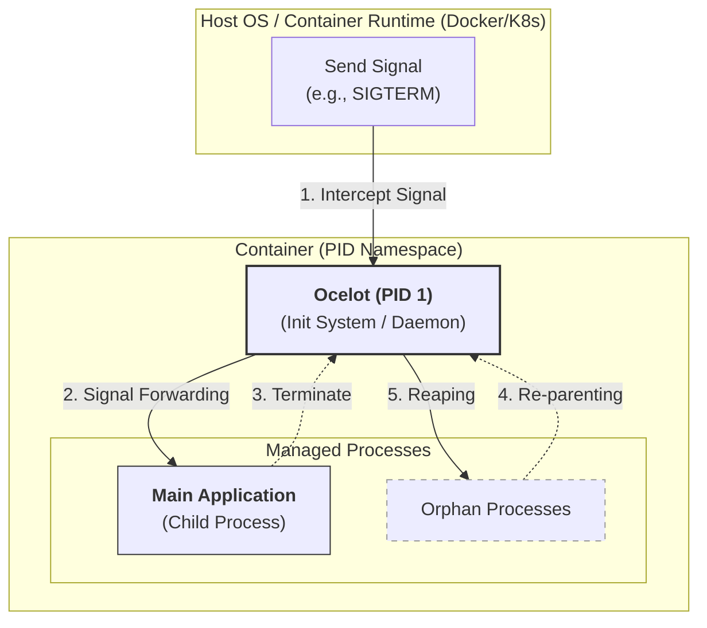

<h1 align="center">Ocelot</h1>

<p align="center">
A minimalist process supervisor and init system written in the <a href="https://www.rust-lang.org/" target="_blank">Rust Programming Language</a>. It is specifically designed to act as a lightweight PID 1 process in containerized environments, ensuring that zombie processes are reaped and system signals are handled gracefully.
</p>

<p align="center">
    <a href="https://github.com/xrelkd/ocelot/releases"></a>
    <a href="https://deps.rs/repo/github/xrelkd/ocelot"></a>
    <a href="https://github.com/xrelkd/ocelot/actions?query=workflow%3ARust"></a>
    <a href="https://github.com/xrelkd/ocelot/actions?query=workflow%3ARelease"></a>
    <a href="https://github.com/xrelkd/ocelot/blob/main/LICENSE"></a>
</p>

---



## Table of Contents

- [Usage](#-usage)
  - [The `idle` Command](#the-idle-command-kubernetes-pause-equivalent)
  - [The `entry` Command](#the-entry-command-minimal-init--supervisor)
  - [The `supervise` Command](#the-supervise-command-advanced-process-supervisor)
  - [The `zombie` Command](#the-zombie-command)
- [Command Line Interface](#-command-line-interface)
  - [Environment Variables](#environment-variables)
  - [Main Command](#main-command)
  - [idle](#idle)
  - [entry](#entry)
  - [supervise](#supervise)
  - [zombie](#zombie)
  - [zombie-finder](#zombie-finder)
- [Installation](#-installation)
  - [From Source](#from-source)
  - [Shell Completions](#shell-completions)
- [Running in Docker](#-running-in-docker)
- [Configuration Reference](#-configuration-reference)
- [Contributing](#contributing)
- [License](#license)

---

## 🛠 Usage

### The `idle` Command (Kubernetes Pause Equivalent)

The `idle` command is the core functionality for container init responsibilities. It is designed to be a direct replacement for the Kubernetes pause process, serving as the "infra" container or parent process that:

- **Holds Namespaces**: Keeps the network/IPC namespaces alive by waiting indefinitely.
- **Reaps Zombies**: Acts as `PID 1` to listen for `SIGCHLD` and reap orphaned processes.
- **Graceful Shutdown**: Properly handles `SIGINT` or `SIGTERM` to allow the pod to terminate cleanly.

---

### The `entry` Command (Minimal Init & Supervisor)

The `entry` command provides a robust entry point for containerized workloads, serving as a minimal init system (PID 1). It is designed to manage the full lifecycle of a primary application while ensuring the container remains stable and responsive. Its key responsibilities include:

- **Process Supervision**: Spawns a child process via fork/exec and tracks its execution state, returning the correct Unix exit codes (including signal offsets).
- **Signal Forwarding & Proxying**: Intercepts SIGINT and SIGTERM from the container runtime and propagates them to the child process to facilitate graceful shutdowns.
- **Zombie Reaping**: Monitors SIGCHLD to proactively reap orphaned or "zombie" processes, preventing process table exhaustion within the PID namespace.
- **Graceful Timeout Enforcement**: Implements a configurable "kill-timer" that allows the child process a window to exit cleanly before forcibly terminating it with SIGKILL.

---

### The `supervise` Command (Advanced Process Supervisor)

The `supervise` command is an advanced multi-process supervisor designed for managing complex containerized workloads. It provides enterprise-grade process management features including:

- **Multi-Process Management**: Spawn and manage multiple processes defined in a YAML configuration file
- **Health Probes**: Built-in readiness and liveness probe support with multiple handler types:
  - HTTP GET probes for HTTP endpoints
  - TCP Socket probes for TCP port checks
- **Restart Policies**: Flexible restart strategies:
  - `Never`: Do not restart on exit
  - `OnFailure`: Restart on non-zero exit (with configurable max retries and backoff)
  - `Always`: Always restart on exit
- **Graceful Shutdown**: Configurable termination signals (SIGTERM, SIGKILL, etc.) and grace periods
- **Dependency Management**: Orchestrates process startup and shutdown ordering through the orchestrator
- **Process State Tracking**: Monitors and tracks the state of each managed process
- **Configuration Validation**: Validate configuration files without starting the supervisor using `ocelot supervise validate <config-file>`. Supports JSON output with `--output json` for automation.

You can validate a configuration file with:

```bash
ocelot supervise validate config.yaml

# For machine-readable output (e.g., in CI)
ocelot supervise validate --output json config.yaml
```

---

### The `zombie` Command

The `zombie` command is a specialized systems utility that illustrates a classic edge case in Unix process management.

**WARNING**: This command is intended for local testing and educational use. Generating an excessive number of zombie processes can exhaust the system's process ID (PID) limit, potentially preventing new processes from starting.

#### Core Behavior

Upon execution, the program enters a continuous loop where it utilizes the `fork()` system call to spawn new child processes. Each child process is programmed to terminate immediately. However, the parent process is explicitly designed to not call `wait()` or `waitpid()`.

#### The Resulting State

Under standard Unix semantics, when a child terminates, the kernel retains its exit status and process ID in the process table so the parent can eventually retrieve it. Because this parent process ignores these "death certificates," the children transition into a Zombie state (`Z`), appearing as `<defunct>` in system monitors like ps or top.

#### Signal Handling and Cleanup

The application is built to be "fire-and-forget":

- **Signal Interruption**: The parent process monitors for `SIGINT` (Ctrl+C) and `SIGTERM`.
- **Instant Exit**: Upon receiving these signals, the parent terminates immediately without attempting to clean up or "reap" its children.
- **System Recovery**: Once the parent process dies, the orphaned zombie processes are adopted by the system's init process (PID 1), which automatically reaps them, clearing them from the system process table.

---

## 🛠 Command Line Interface

### Environment Variables

| Variable           | Description                                             | Default |
| ------------------ | ------------------------------------------------------- | ------- |
| `OCELOT_LOG_LEVEL` | Set the logging level (trace, debug, info, warn, error) | `info`  |

---

### Main Command

```text
$ ocelot --help
Process supervisor and init system written in Rust Programming Language

Usage: ocelot [COMMAND]

Commands:
  version        Print the version information
  completions    Output shell completion code for the specified shell (bash, zsh, fish)
  idle           Run as a minimalist PID 1 to reap zombies and hold namespaces [aliases: noop, pause]
  entry          Spawns and supervises a child process as a minimalist PID 1 with signal forwarding and zombie reaping [aliases: wrap]
  supervise      Run supervisor with configuration file
  zombie         Creates zombie processes by forking child processes that immediately exit, while the parent process sleeps. This is useful for testing how systems handle zombie processes.
  zombie-finder  Scan system for zombie processes
  help           Print this message or the help of the given subcommand(s)

Options:
  -h, --help     Print help
  -V, --version  Print version
```

---

### idle

```text
$ ocelot idle --help
Acts as a 'pause' container equivalent. It enters an infinite loop waiting for signals. When SIGCHLD is received, it reaps exited child processes to prevent zombies. This is essential when running in environments where this process is the sub-grid anchor (PID 1).

Usage: ocelot idle [OPTIONS]

Options:
      --log-level <LOG_LEVEL>
          [env: OCELOT_LOG_LEVEL=]
          [default: info]

  -h, --help
          Print help (see a summary with '-h')
```

---

### entry

```text
$ ocelot entry --help
Acts as a process supervisor and init system for containerized workloads. It forks and executes a child process, then assumes responsibility for the PID 1 lifecycle. It ensures system stability by proactively reaping zombie processes via SIGCHLD and proxies termination signals (SIGINT/SIGTERM) to the child. If the child fails to exit within a grace period, it enforces a SIGKILL to ensure the container terminates. This is essential for preventing process leaks and ensuring clean shutdowns in orchestrated environments.

Usage: ocelot entry [OPTIONS] [COMMANDS]...

Arguments:
  [COMMANDS]...

Options:
      --log-level <LOG_LEVEL>
          [env: OCELOT_LOG_LEVEL=]
          [default: info]

      --timeout-ms <TIMEOUT_MS>
          Specify a timeout in milliseconds for the command to execute.

  -h, --help
          Print help (see a summary with '-h')
```

---

### supervise

```text
$ ocelot supervise --help
Run supervisor with configuration file. If no subcommand is provided, runs the supervisor. Use 'config-template' to output the default configuration.

Usage: ocelot supervise [OPTIONS] [COMMAND]

Commands:
  run              Run supervisor with configuration file [aliases: r]
  config-template  Output the configuration template in YAML format
  validate         Validate the configuration file
  help             Print this message or the help of the given subcommand(s)

Options:
  -f, --file <FILE>


      --log-level <LOG_LEVEL>
          [env: OCELOT_LOG_LEVEL=]

  -h, --help
          Print help (see a summary with '-h')
```

#### validate

```text
$ ocelot supervise validate --help
Validate the configuration file

Usage: ocelot supervise validate [OPTIONS] <FILE>

Arguments:
  <FILE>

Options:
      --output <OUTPUT>  [default: human] [possible values: human, json]
  -h, --help             Print help
```

```text
$ ocelot supervise run --help
Run supervisor with configuration file

Usage: ocelot supervise run [OPTIONS] --file <FILE>

Options:
  -f, --file <FILE>
      --log-level <LOG_LEVEL>  [env: OCELOT_LOG_LEVEL=] [default: info]
  -h, --help                   Print help
```

```text
$ ocelot supervise config-template
Output the configuration template in YAML format

Usage: ocelot supervise config-template

Options:
  -h, --help  Print help
```

---

### zombie

```text
$ ocelot zombie --help
This command creates zombie processes by repeatedly forking child processes that immediately exit, while the parent process sleeps for a specified interval. The parent process continues to spawn new child processes until an optional limit is reached or it receives a termination signal. This is useful for testing how systems handle zombie processes and ensuring that they are properly reaped.

Usage: ocelot zombie [OPTIONS]

Options:
      --log-level <LOG_LEVEL>
          [env: OCELOT_LOG_LEVEL=]
          [default: info]

  -i, --interval-ms <INTERVAL_MS>
          [default: 200]

  -c, --count <COUNT>


  -h, --help
          Print help (see a summary with '-h')
```

---

### zombie-finder

```text
$ ocelot zombie-finder --help
Scans the system for existing zombie processes using procfs. It lists the PID and command name of each zombie process found. This is useful for monitoring system health and identifying processes that have exited but have not been reaped by their parent processes.

Usage: ocelot zombie-finder

Options:
  -h, --help
          Print help (see a summary with '-h')
```

---

## 🚀 Installation

### From Source

To build and install Ocelot from source, ensure you have the Rust toolchain installed:

```bash
git clone https://github.com/xrelkd/ocelot.git
cd ocelot
cargo install --path .
```

### Shell Completions

Generate autocompletion scripts for your favorite shell:

```bash
# For Zsh
ocelot completions zsh > /usr/local/share/zsh/site-functions/_ocelot

# For Bash
ocelot completions bash > /etc/bash_completion.d/ocelot
```

---

## 🐳 Running in Docker

Using Ocelot as your `ENTRYPOINT` ensures that your container correctly manages the process lifecycle.

- Play as the "idle" command for a simple init system that holds namespaces and reaps zombies

```dockerfile
# Use ocelot as the init system in your Dockerfile
COPY --from=ocelot /usr/bin/ocelot /usr/bin/ocelot

# Run with 'idle' to handle PID 1 duties
ENTRYPOINT ["ocelot", "idle"]
```

- Play as the "entry" command to supervise a child process with signal forwarding and zombie reaping

```dockerfile
# Use ocelot as the init system in your Dockerfile
COPY --from=ocelot /usr/bin/ocelot /usr/bin/ocelot

# Run with 'entry' to handle PID 1 duties
ENTRYPOINT ["ocelot", "entry", "--", "ocelot", "zombie", "--count=20"]
```

- Play as the "supervise run" command to manage multiple processes with health probes and restart policies

```dockerfile
# Use ocelot as the init system in your Dockerfile
COPY --from=ocelot /usr/bin/ocelot /usr/bin/ocelot
COPY supervisor.yaml /etc/ocelot/supervisor.yaml

# Run with 'supervise run' to manage multiple processes
ENTRYPOINT ["ocelot", "supervise", "run", "--file", "/etc/ocelot/supervisor.yaml"]
```

---

## 📋 Configuration Reference

> **Note**: This configuration reference applies only to the `supervise` command.

The `supervise` command uses a YAML configuration file to define managed processes. Generate the default configuration template with:

```bash
ocelot supervise config-template
```

> **Note**: Duration fields (e.g., `terminationGracePeriod`, probe timings, `backoff`) accept human-readable strings like "30s", "1m", "1h", "2h 30m", etc. Size fields like `maxSizeBytes` accept integers (bytes) or human-readable strings like "10MB", "1GB", "512KB", "1.5GiB".

### Configuration Schema

| Field                                     | Type              | Description                                    |
| ----------------------------------------- | ----------------- | ---------------------------------------------- |
| `version`                                 | string            | Configuration version (e.g., "1.0")            |
| `processes`                               | map               | Map of process definitions                     |
| `processes.<name>.program`                | string            | Path to the executable                         |
| `processes.<name>.arguments`              | list              | Command-line arguments                         |
| `processes.<name>.environmentVariables`   | map               | Environment variables                          |
| `processes.<name>.workingDirectory`       | string            | Working directory                              |
| `processes.<name>.terminationGracePeriod` | string (duration) | Grace period before termination (e.g., "30s")  |
| `processes.<name>.readinessProbe`         | object            | Readiness probe configuration                  |
| `processes.<name>.livenessProbe`          | object            | Liveness probe configuration                   |
| `processes.<name>.restartPolicy`          | object            | Restart policy configuration                   |
| `processes.<name>.shutdownSignal`         | object            | Signal to send on shutdown                     |
| `processes.<name>.log`                    | object            | Log configuration for stdout/stderr (optional) |

### Duration Format

Duration fields accept human-readable time strings using the `humantime` format. The duration is a concatenation of time spans, where each time span consists of an integer number and a suffix.

**Supported suffixes:**

- `nsec`, `ns` – nanoseconds
- `usec`, `us`, `µs` – microseconds
- `msec`, `ms` – milliseconds
- `seconds`, `second`, `sec`, `s`
- `minutes`, `minute`, `min`, `m`
- `hours`, `hour`, `hr`, `hrs`, `h`
- `days`, `day`, `d`
- `weeks`, `week`, `wk`, `wks`, `w`
- `months`, `month`, `M` – defined as 30.44 days
- `years`, `year`, `yr`, `yrs`, `y` – defined as 365.25 days

**Examples:**

```yaml
terminationGracePeriod: 30s
terminationGracePeriod: 1m 30s
terminationGracePeriod: 2h 15m
terminationGracePeriod: 1h 30m 45s
initialDelay: 250ms
backoff: 1.5s
```

### Size Format

Size fields like `maxSizeBytes` accept either raw integers (bytes) or human-readable strings using SI/IEC prefixes.

**Supported units (case-insensitive):**

- SI (decimal) units: `KB` (kilobyte, 1000), `MB` (megabyte, 1000²), `GB` (gigabyte, 1000³), `TB`, `PB`, `EB`
- IEC (binary) units: `KiB` (kibibyte, 1024), `MiB` (mebibyte, 1024²), `GiB` (gibibyte, 1024³), `TiB`, `PiB`, `EiB`

**Examples:**

```yaml
rotation:
  maxSizeBytes: 10MB      # 10,000,000 bytes
  maxSizeBytes: 1GB       # 1,000,000,000 bytes
  maxSizeBytes: 512KiB    # 524,288 bytes
  maxSizeBytes: 1.5GiB    # 1,610,612,736 bytes
```

### Probe Configuration

Readiness and liveness probes support the following handler types:

```yaml
# HTTP GET Probe
handler:
  type: httpGet
  path: /health
  port: 80

# TCP Socket Probe
handler:
  type: tcpSocket
  host: localhost
  port: 5432
```

Probe timing options (durations, e.g., "5s", "1m"):

- `initialDelay`: Time to wait before first probe
- `period`: Interval between probes
- `timeout`: Probe timeout duration
- `failureThreshold`: Consecutive failures before taking action
- `successThreshold`: Consecutive successes before marking healthy

### Restart Policy Types

```yaml
# Never restart
restartPolicy:
  type: Never

# Restart on failure with backoff
restartPolicy:
  type: OnFailure
  maxRetries: 3
  backoff: 5s

# Always restart
restartPolicy:
  type: Always
  backoff: 1s
```

### Shutdown Signal Types

```yaml
# Signal by name
shutdownSignal:
  type: name
  value: SIGTERM

# Signal by number
shutdownSignal:
  type: number
  value: 9

# Default signal (SIGTERM)
shutdownSignal:
  type: sigterm
```

### Log Configuration

Processes can optionally configure logging for their standard output and error streams via the `log` field. The configuration supports three destinations:

- **`null`**: Discard all output (equivalent to `/dev/null`).
- **`inherit`**: Use the supervisor's stdout/stderr (default if no log configuration is provided).
- **`file`**: Write output to a file, with optional rotation.

Log configuration is set per stream (`stdout` and `stderr`) and includes rotation options:

- `maxSizeBytes`: Maximum file size before rotating. Accepts integers (bytes) or human-readable strings (`"10MB"`, `"1GB"`).
- `rotationInterval`: Time-based rotation interval as a duration (e.g., `"24h"`, `"1h"`).
- `maxFiles`: Maximum number of rotated files to retain (older files are deleted).
- `maxAgeDays`: Maximum age in days for rotated files before automatic deletion.
- `mode`: File creation permissions as an octal string (e.g., `"644"`, `"600"`).
- `compression`: Compression algorithm for rotated logs (`none`, `gzip`, or `lz4`).

Example log configuration:

```yaml
log:
  stdout:
    destination:
      type: file
      path: /var/log/myapp/stdout.log
    rotation:
      maxSizeBytes: 10MB
      rotationInterval: 24h
      maxFiles: 7
      compression: gzip
  stderr:
    destination:
      type: inherit
```

If no `log` section is specified, both stdout and stderr default to `inherit`.

### Example Configuration

```yaml
version: "1.0"

processes:
  nginx:
    program: /usr/sbin/nginx
    arguments:
      - -g
      - daemon off;
    terminationGracePeriod: 60s
    readinessProbe:
      handler:
        type: httpGet
        path: /health
        port: 80
      initialDelay: 5s
      period: 10s
      timeout: 1s
      failureThreshold: 3
      successThreshold: 1
    livenessProbe:
      handler:
        type: tcpSocket
        host: localhost
        port: 80
      period: 30s
      timeout: 5s
      failureThreshold: 3
    restartPolicy:
      type: Never
    shutdownSignal:
      type: sigterm

  myapp:
    program: /usr/bin/myapp
    arguments:
      - --config
      - /etc/myapp/config.yaml
    environmentVariables:
      LOG_LEVEL: info
      DATABASE_URL: postgres://localhost:5432/mydb
    workingDirectory: /opt/myapp
    terminationGracePeriod: 30s
    shutdownSignal:
      type: name
      value: SIGTERM
    restartPolicy:
      type: OnFailure
      maxRetries: 3
      backoff: 5s
    log:
      stdout:
        destination:
          type: file
          path: /var/log/myapp/stdout.log
        rotation:
          maxSizeBytes: 10MB
          rotationInterval: 24h
          maxFiles: 7
      stderr:
        destination:
          type: file
          path: /var/log/myapp/stderr.log
        rotation:
          maxSizeBytes: 10MB

  redis:
    program: /usr/bin/redis-server
    arguments:
      - --port
      - 6379
    terminationGracePeriod: 10s
    shutdownSignal:
      type: number
      value: 9
    restartPolicy:
      type: Always
      backoff: 1s

  postgres:
    program: /usr/bin/postgres
    arguments:
      - -D
      - /var/lib/postgresql/data
    environmentVariables:
      POSTGRES_USER: admin
      POSTGRES_PASSWORD: secret
    workingDirectory: /var/lib/postgresql
    terminationGracePeriod: 30s
    readinessProbe:
      handler:
        type: tcpSocket
        port: 5432
      initialDelay: 10s
      period: 5s
      timeout: 3s
      failureThreshold: 3
    livenessProbe:
      handler:
        type: tcpSocket
        port: 5432
      initialDelay: 15s
      period: 20s
      timeout: 3s
      failureThreshold: 3
    restartPolicy:
      type: Always
      backoff: 1s
```

---

## Contributing

Contributions are welcome! Please read the [Contributing Guide](CONTRIBUTING.md) for details on the development workflow, commit message conventions, and how to submit pull requests.

Quick start:

```bash
# Enter the development environment (requires Nix)
nix develop

# Or use direnv for automatic environment loading
direnv allow

# Build and test
cargo build
cargo nextest run
```

---

## License

Ocelot is licensed under the GNU General Public License version 3. See [LICENSE](./LICENSE) for more information.
