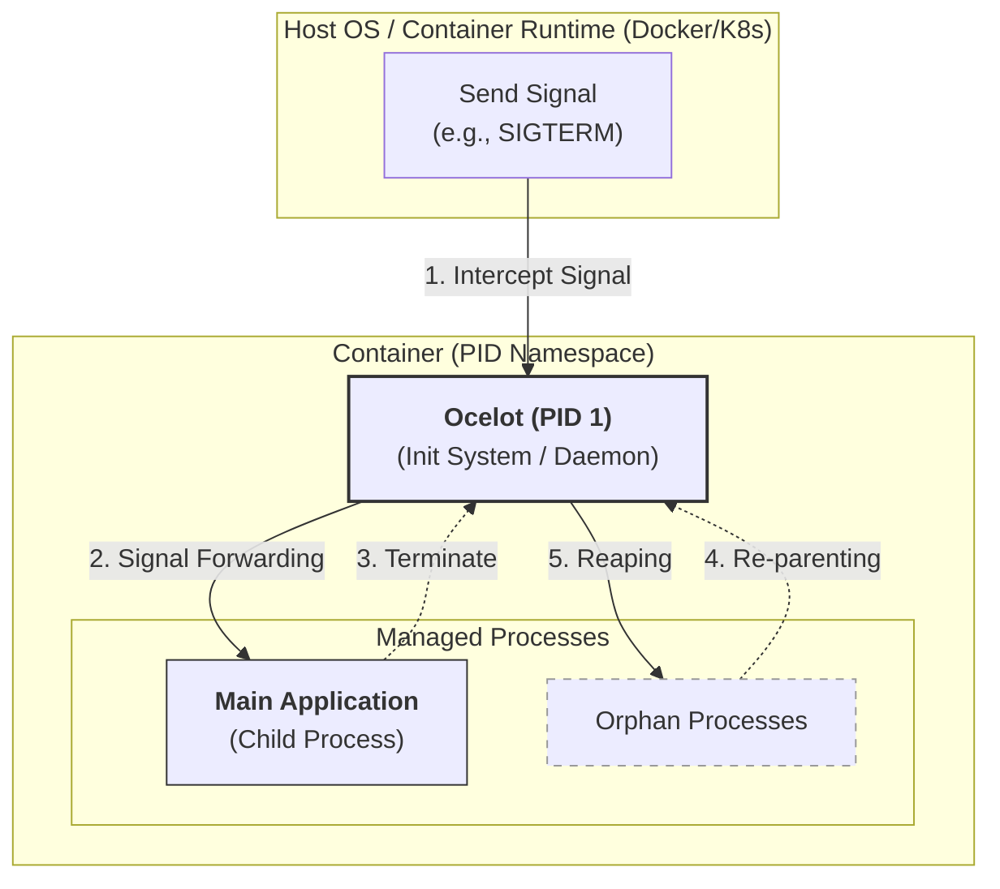

<h1 align="center">Ocelot</h1>

<p align="center">
A minimalist process supervisor and init system written in the <a href="https://www.rust-lang.org/" target="_blank">Rust Programming Language</a>. It is specifically designed to act as a lightweight PID 1 process in containerized environments, ensuring that zombie processes are reaped and system signals are handled gracefully.
</p>

> [!Note]
> Ocelot is designed for specific use cases like container initialization and minimal supervision scenarios.
> It is not intended to replace comprehensive init systems like systemd in general-purpose operating systems.

<p align="center">
    <a href="https://github.com/xrelkd/ocelot/releases"></a>
    <a href="https://deps.rs/repo/github/xrelkd/ocelot"></a>
    <a href="https://github.com/xrelkd/ocelot/actions?query=workflow%3ARust"></a>
    <a href="https://github.com/xrelkd/ocelot/actions?query=workflow%3ARelease"></a>
    <a href="https://github.com/xrelkd/ocelot/blob/main/LICENSE"></a>
</p>

---



## Table of Contents

- [Quick Start](#quick-start)
- [Which Command Should I Use?](#which-command-should-i-use)
- [FAQ](#faq)
- [Concept](#concept)
  - [The `idle` Command](#the-idle-command-kubernetes-pause-equivalent)
  - [The `entry` Command](#the-entry-command-minimal-init--supervisor)
  - [The `supervise` Command](#the-supervise-command-advanced-process-supervisor)
  - [The `bootstrap` Command](#the-bootstrap-command)
  - [The `zombie` Command](#the-zombie-command)
- [Command Line Interface](#command-line-interface)
  - [Environment Variables](#environment-variables)
  - [Main Command](#main-command)
  - [idle](#idle)
  - [entry](#entry)
  - [supervise](#supervise)
  - [bootstrap](#bootstrap)
  - [zombie](#zombie)
  - [zombie-finder](#zombie-finder)
- [Resource Usage](#resource-usage)
- [Installation](#installation)
  - [From Source](#from-source)
  - [Static Binary Build](#static-binary-build)
  - [Shell Completions](#shell-completions)
- [Running in Docker](#running-in-docker)
- [Configuration Reference](#configuration-reference)
- [Examples](#examples)
- [Contributing](#contributing)
- [License](#license)

---

## Quick Start

### Add Ocelot to your container

First, copy Ocelot from the container registry into your Dockerfile:

```dockerfile
COPY --from=ghcr.io/xrelkd/ocelot:latest /usr/bin/ocelot /usr/bin/ocelot
```

### Run with a supervised application

```bash
# Single app with signal forwarding
docker run -it --entrypoint ocelot your-image entry -- your-app

# Multiple processes with health probes
docker run -it --entrypoint "ocelot supervise run --file /etc/ocelot/supervisor.yaml" your-image
```

> **First time?** Start with `entry` for simple apps, or `supervise` for complex multi-process workloads.

## Which Command Should I Use?

| Command     | Use Case                                                              | Example                      |
| ----------- | --------------------------------------------------------------------- | ---------------------------- |
| `idle`      | Just reap zombies and hold namespaces (Kubernetes pause equivalent)   | Pod infrastructure container |
| `entry`     | Run one main app with signal forwarding and zombie reaping            | Single-process containers    |
| `supervise` | Multiple processes with health probes, restart policies, dependencies | Complex microservices        |
| `bootstrap` | VM boot / initramfs initialization                                    | QEMU VMs, embedded systems   |
| `zombie`    | Testing/debugging zombie process handling                             | Local testing only           |

### Decision Flow

```text
Do you need to run applications?
├─ No → Use `idle` (just hold namespaces)
└─ Yes → How many?
    ├─ One → Does it need health checks / restart?
    │   ├─ No → Use `entry`
    │   └─ Yes → Use `supervise`
    └─ Many → Use `supervise`

Need to boot a VM?
└─ Use `bootstrap`
```

## FAQ

### Do I need Ocelot in my container?

If your container runs only a single process and your application handles signals properly, you may not need Ocelot. However, Ocelot is recommended when:

- You run multiple processes (e.g., sidecar containers, log collectors)
- You want built-in zombie reaping without modifying your application
- You need health checks and restart policies

### What's the binary size?

Ocelot compiles to a static binary of approximately **2-3 MB**, making it lightweight for container deployments. You can further reduce size with `--release` and stripping debug symbols.

### Does it work with Kubernetes?

Yes! Ocelot works seamlessly with Kubernetes:

- Use `idle` as a pause container replacement
- Use `entry` or `supervise` as your container's entrypoint
- Works with liveness/readiness probes (when using `supervise`)

### Does Ocelot support Windows containers?

Not currently. Ocelot is designed for Linux containers and VMs.

---

## 🛠 Concept

### The `idle` Command (Kubernetes Pause Equivalent)

The `idle` command is the core functionality for container init responsibilities. It is designed to be a direct replacement for the Kubernetes pause process, serving as the "infra" container or parent process that:

- **Holds Namespaces**: Keeps the network/IPC namespaces alive by waiting indefinitely.
- **Reaps Zombies**: Acts as `PID 1` to listen for `SIGCHLD` and reap orphaned processes.
- **Graceful Shutdown**: Properly handles `SIGINT` or `SIGTERM` to allow the pod to terminate cleanly.

---

### The `entry` Command (Minimal Init & Supervisor)

The `entry` command provides a robust entry point for containerized workloads, serving as a minimal init system (PID 1). It is designed to manage the full lifecycle of a primary application while ensuring the container remains stable and responsive. Its key responsibilities include:

- **Process Supervision**: Spawns a child process via fork/exec and tracks its execution state, returning the correct Unix exit codes (including signal offsets).
- **Signal Forwarding & Proxying**: Intercepts `SIGINT` and `SIGTERM` from the container runtime and propagates them to the child process to facilitate graceful shutdowns.
- **Zombie Reaping**: Monitors `SIGCHLD` to proactively reap orphaned or "zombie" processes, preventing process table exhaustion within the PID namespace.
- **Graceful Timeout Enforcement**: Implements a configurable "kill-timer" that allows the child process a window to exit cleanly before forcibly terminating it with SIGKILL.

---

### The `supervise` Command (Advanced Process Supervisor)

The `supervise` command is an advanced multi-process supervisor designed for managing complex containerized workloads. It provides enterprise-grade process management features including:

- **Multi-Process Management**: Spawn and manage multiple processes defined in a YAML configuration file
- **Health Probes**: Built-in readiness and liveness probe support with multiple handler types:
  - HTTP GET probes for HTTP endpoints
  - TCP Socket probes for TCP port checks
- **Restart Policies**: Flexible restart strategies:
  - `Never`: Do not restart on exit
  - `OnFailure`: Restart on non-zero exit (with configurable max retries and backoff)
  - `Always`: Always restart on exit
- **Graceful Shutdown**: Configurable termination signals (`SIGTERM`, `SIGKILL`, etc.) and grace periods
- **Dependency Management**: Orchestrates process startup and shutdown ordering through the orchestrator
- **Process State Tracking**: Monitors and tracks the state of each managed process
- **Configuration Validation**: Validate configuration files without starting the supervisor using `ocelot supervise validate <config-file>`. Supports JSON output with `--output json` for automation.

---

### The `bootstrap` Command

The `bootstrap` command acts as an initramfs init system for QEMU VMs. It provides a three-tier phased initialization architecture:

- **Pre-switch Phase**: Mounts virtual filesystems, loads kernel modules, configures system settings
- **Switch-root Phase**: Mounts the root filesystem and performs `switch_root`
- **Post-switch Phase**: Continues configuration and hands off to `supervise` orchestrator, `shell`, or `exec` program

Key features include:

- Kernel modules loading
- Virtual filesystem mounting (`procfs`, `sysfs`, `devpts`, `tmpfs`, etc.)
- Root filesystem mounting (device, `virtiofs`, `9p`, `NFS`, `overlay`)
- Boot script execution
- Handoff modes: supervise orchestrator, interactive shell, or exec program

---

### The `zombie` Command

The `zombie` command is a specialized systems utility that illustrates a classic edge case in Unix process management.

> [!WARNING] This command is intended for local testing and educational use.
> Generating an excessive number of zombie processes can exhaust the system's process ID (PID) limit, potentially preventing new processes from starting.

#### Core Behavior

Upon execution, the program enters a continuous loop where it utilizes the `fork()` system call to spawn new child processes. Each child process is programmed to terminate immediately. However, the parent process is explicitly designed to not call `wait()` or `waitpid()`.

#### The Resulting State

Under standard Unix semantics, when a child terminates, the kernel retains its exit status and process ID in the process table so the parent can eventually retrieve it. Because this parent process ignores these "death certificates," the children transition into a Zombie state (`Z`), appearing as `<defunct>` in system monitors like ps or top.

#### Signal Handling and Cleanup

The application is built to be "fire-and-forget":

- **Signal Interruption**: The parent process monitors for `SIGINT` (Ctrl+C) and `SIGTERM`.
- **Instant Exit**: Upon receiving these signals, the parent terminates immediately without attempting to clean up or "reap" its children.
- **System Recovery**: Once the parent process dies, the orphaned zombie processes are adopted by the system's init process (PID 1), which automatically reaps them, clearing them from the system process table.

---

## 🛠 Command Line Interface

### Environment Variables

| Variable           | Description                                             | Default |
| ------------------ | ------------------------------------------------------- | ------- |
| `OCELOT_LOG_LEVEL` | Set the logging level (trace, debug, info, warn, error) | `info`  |

---

### Main Command

```text
# Show version
$ ocelot --version

# Show usage
$ ocelot --help
Process supervisor and init system written in Rust Programming Language

Usage: ocelot [COMMAND]

Commands:
  version        Print the version information
  completions    Output shell completion code for the specified shell (bash, zsh, fish)
  idle           Run as a minimalist PID 1 to reap zombies and hold namespaces [aliases: noop, pause]
  entry          Spawns and supervises a child process as a minimalist PID 1 with signal forwarding and zombie reaping [aliases: wrap]
  supervise      Run supervisor with configuration file
  bootstrap      Run as initramfs init - mount rootfs and exec supervise [aliases: boot]
  zombie         Creates zombie processes by forking child processes that immediately exit, while the parent process sleeps. This is useful for testing how systems handle zombie processes.
  zombie-finder  Scan system for zombie processes
  help           Print this message or the help of the given subcommand(s)

Options:
  -h, --help     Print help
  -V, --version  Print version
```

---

### idle

```text
# Show usage
$ ocelot idle --help

# Run
$ ocelot idle
```

---

### entry

```text
# Show usage
$ ocelot entry --help

# Run with a child process
$ ocelot entry sleep 10
```

---

### supervise

```text
# Show usage
$ ocelot supervise --help

# Generate the configuration file
$ ocelot supervise config-template > /path/to/the/configuration/file

# Open your favorite editor and edit the configuration file
$ vim /path/to/the/configuration/file

# Validate the configuration file
$ ocelot supervise validate /path/to/the/configuration/file

# Run supervisor with configuration file
$ ocelot supervise run --file /path/to/the/configuration/file
```

> [!Note] For configuration details, see the [Configuration Reference](#configuration-reference) section.

---

### bootstrap

```text
# Show usage
$ ocelot bootstrap --help

# Generate the configuration file
$ ocelot bootstrap config-template > /path/to/the/configuration/file

# Open your favorite editor and edit the configuration file
$ vim /path/to/the/configuration/file

# Validate the configuration file
$ ocelot bootstrap validate /path/to/the/configuration/file
```

---

> [!Note] For configuration details, see the [Configuration Reference](#configuration-reference) section.

> [!Note] For examples of `initramfs` setup and QEMU VM booting, see the [Examples](#examples) section.

### zombie

```text
# Show usage
$ ocelot zombie --help

# Generate zombies
$ ocelot zombie
```

---

### zombie-finder

```text
# Show usage
$ ocelot zombie-finder --help

# List zombies
$ ocelot zombie-finder
```

---

## 📊 Resource Usage

| Metric                      | Value                     |
| --------------------------- | ------------------------- |
| Binary size (release, musl) | ~2-3 MB                   |
| Static binary               | Yes (no glibc dependency) |
| Memory usage                | ~1-2 MB idle              |
| Dependencies                | None (fully static)       |

Build with `cargo build --release --target x86_64-unknown-linux-musl` for fully static binaries.

Ocelot is designed for minimal resource overhead, making it ideal for containerized environments where every megabyte counts.

---

## 🚀 Installation

### From Source

To build and install Ocelot from source, ensure you have the Rust toolchain installed:

```bash
git clone https://github.com/xrelkd/ocelot.git
cd ocelot
cargo install --path .
```

### Static Binary Build

To build a fully static-linked binary (no glibc dependency) for container use:

```bash
cargo build --release --target x86_64-unknown-linux-musl
```

The static binary will be at `target/x86_64-unknown-linux-musl/release/ocelot`.

### Shell Completions

Generate autocompletion scripts for your favorite shell:

```bash
# For Zsh
ocelot completions zsh > /usr/local/share/zsh/site-functions/_ocelot

# For Bash
ocelot completions bash > /etc/bash_completion.d/ocelot
```

---

## 🐳 Running in Docker

Using Ocelot as your `ENTRYPOINT` ensures that your container correctly manages the process lifecycle.

- Use the "idle" command for a simple init system that holds namespaces and reaps zombies

```dockerfile
# Use ocelot as the init system in your Dockerfile
COPY --from=ghcr.io/xrelkd/ocelot:latest /usr/bin/ocelot /usr/bin/ocelot

# Run with 'idle' to handle PID 1 duties
ENTRYPOINT ["ocelot", "idle"]
```

- Use the "entry" command to supervise a child process with signal forwarding and zombie reaping

```dockerfile
# Use ocelot as the init system in your Dockerfile
COPY --from=ghcr.io/xrelkd/ocelot:latest /usr/bin/ocelot /usr/bin/ocelot

# Run with 'entry' to handle PID 1 duties
ENTRYPOINT ["ocelot", "entry", "--", "ocelot", "zombie", "--count=20"]
```

- Use the "supervise run" command to manage multiple processes with health probes and restart policies

```dockerfile
# Use ocelot as the init system in your Dockerfile
COPY --from=ghcr.io/xrelkd/ocelot:latest /usr/bin/ocelot /usr/bin/ocelot
COPY supervisor.yaml /etc/ocelot/supervisor.yaml

# Run with 'supervise run' to manage multiple processes
ENTRYPOINT ["ocelot", "supervise", "run", "--file", "/etc/ocelot/supervisor.yaml"]
```

### Troubleshooting

**Container doesn't stop gracefully?**

- Check your application's signal handling
- Verify your app receives `SIGTERM` (add debug logging)

**Zombie processes appearing?**

- Ensure Ocelot is PID 1
- Check child processes aren't double-forking

---

## 📋 Configuration Reference

Ocelot uses two different configuration systems depending on the command:

- **[Supervise](docs/supervise-config.md)**: For managing multiple processes in containerized workloads (PID 1 replacement with health probes, restart policies, and dependency management)
- **[Bootstrap](docs/bootstrap-config.md)**: For initramfs-style system initialization (mounting filesystems, loading modules, switch_root, and handoff to supervisor or shell)

For full configuration documentation, see:

- **[Supervise Configuration](docs/supervise-config.md)**
- **[Bootstrap Configuration](docs/bootstrap-config.md)**

## Examples

See the [examples](examples/) directory for practical demonstrations of Ocelot usage, including QEMU virtual machine initialization.

---

## Contributing

Contributions are welcome! Before you start, please read:

- **[Contributing Guide](CONTRIBUTING.md)** — Development workflow, git conventions, commit message format, and PR process
- **[Coding Conventions](conventions.md)** — Rust coding standards covering imports, attributes, error handling, async patterns, and testing

Quick start:

```bash
# Enter the development environment (requires Nix)
nix develop

# Or use direnv for automatic environment loading
direnv allow

# Build and test
cargo build
cargo nextest run
```

---

## License

Ocelot is licensed under the GNU General Public License version 3. See [LICENSE](./LICENSE) for more information.
